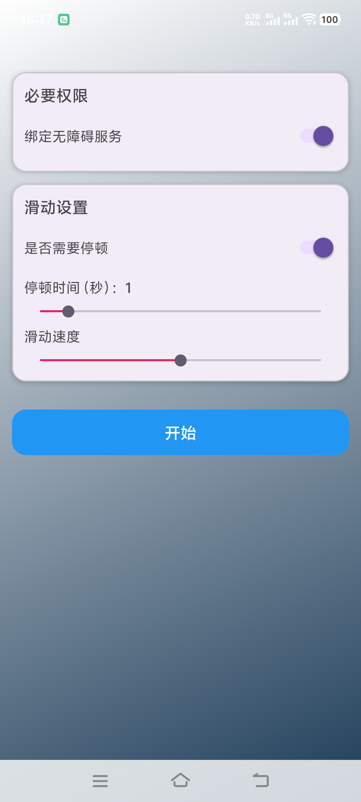

# Android Auto-Slide App [AutoSlide]

[简体中文](README.md) | [English](README.en.md)

A simple and efficient auto-slide solution for Android devices, ideal for automated testing, content browsing, and more.

## Features

- **Timed Sliding**: Customize the time interval between slides
- **Slide Speed**: Multiple speed settings to meet different needs
- **Slide Direction**: Supports sliding in four directions - up, down, left, and right
- **Floating Window Control**: Convenient floating button control; automatically shrinks to a small icon when sliding starts, and expands the panel while stopping when tapped
- **Gesture Simulation**: Precisely simulates finger swipe gestures, ensuring behavior identical to real user operations
- **Smart Permission Management**: Supports "Permanent Authorization" mode (via ADB); automatically activates accessibility service on app launch for enhanced convenience
- **Easy to Use**: Intuitive user interface for effortless parameter configuration

## Screenshots

## Quick Start

### Prerequisites

- Android 14.0 or higher

### Installation

1. Download the latest APK file from the [Releases Page](https://github.com/tianxing-ovo/AutoSlide/releases/)
2. Open the downloaded APK file and follow the on-screen instructions to install the application
3. Launch the app and grant the necessary permissions for proper functionality

## Contributing

We welcome all forms of contributions, including but not limited to bug reports, feature requests, pull requests, and more.

## License

This project is licensed under the Apache License 2.0. See the [LICENSE](LICENSE) file for details.
