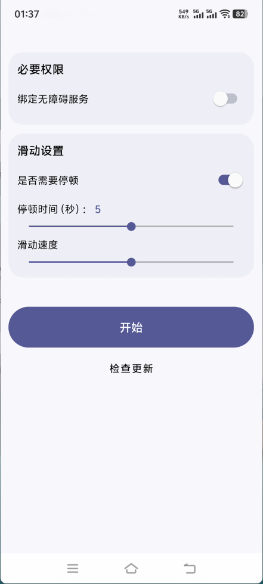

# 安卓自动滑动器APP [AutoSlide]

一款简洁高效的安卓设备自动滑动解决方案，适用于自动化测试、内容浏览等场景

## 功能特性

- **定时滑动**：用户可自定义滑动的时间间隔
- **滑动速度**：支持多种滑动速度设置，满足不同需求
- **滑动方向**：支持上、下、左、右四个方向的滑动
- **手势模拟**：精准模拟手指滑动手势，确保与真实用户操作无异
- **智能权限管理**：支持“永久授权”模式（通过ADB），应用启动时自动激活无障碍服务，操作更便捷
- **简单易用**：直观的用户界面，轻松设置滑动参数

## 截图展示

## 快速开始

### 前提条件

- Android 14.0及以上版本

### 安装步骤

1. 下载最新的APK文件从[发布页面](https://github.com/tianxing-ovo/AutoSlide/releases/)
2. 打开下载的APK文件并按照屏幕上的指示安装应用程序
3. 启动应用，并授予必要的权限以确保其正常运行

## 贡献代码

我们欢迎任何形式的贡献，包括但不限于bug报告、功能请求、pull
requests等

## 许可证

本项目基于Apache License 2.0许可证