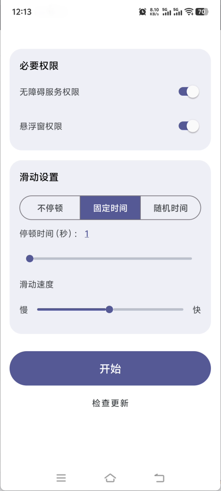

# 安卓自动滑动器APP [AutoSlide]

[简体中文](README.md) | [English](README.en.md)

一款简洁高效的安卓设备自动滑动解决方案，适用于自动化测试、内容浏览等场景

## 功能特性

- **定时滑动**：用户可自定义滑动的时间间隔
- **停顿模式**：支持"不停顿"、"固定时间"及"随机时间"三种停顿模式，并支持手动输入自定义停顿时间；随机模式可设置最小和最大停顿时间范围
- **滑动速度**：支持多种滑动速度设置，并基于更平滑的速度曲线调整手势时长
- **滑动方向**：支持上、下、左、右四个方向的滑动
- **悬浮窗控制**：便捷的悬浮球控制，滑动开始后自动收缩为小图标，点击小图标即可展开面板并自动停止滑动
- **权限管理**：新增悬浮窗权限控制开关，可快速跳转至系统权限设置页面
- **音量键强停**：滑动运行中按音量键可立即停止滑动并恢复悬浮窗面板
- **息屏自停**：屏幕关闭时（包括按电源键）自动停止滑动，防止无效滑动浪费资源
- **手势模拟**：精准模拟手指滑动手势，手势坐标会基于屏幕尺寸动态计算
- **连续滑动优化**：不停顿模式下内置极小间隔，兼顾连续性与稳定性
- **智能权限管理**：支持手动开启、Shizuku 授权及 ADB 授权等多种方式，自动开启无障碍服务更便捷
- **简单易用**：直观的用户界面，轻松设置滑动参数

## 最近更新

- `v2.0`
- 集成 Shizuku 授权，支持更便捷地自动开启无障碍服务
- 优化权限开关监听逻辑，减少重复触发并提升交互体验
- 支持手动输入自定义停顿时间，参数设置更灵活

## 截图展示

## 快速开始

### 前提条件

- Android 12.0及以上版本

### 安装步骤

1. 下载最新的APK文件从[发布页面](https://github.com/tianxing-ovo/AutoSlide/releases/)
2. 打开下载的APK文件并按照屏幕上的指示安装应用程序
3. 启动应用，并授予必要的权限以确保其正常运行

## 贡献代码

我们欢迎任何形式的贡献，包括但不限于bug报告、功能请求、pull
requests等

## 许可证

本项目基于 Apache License 2.0 许可证，详见 [LICENSE](LICENSE) 文件
