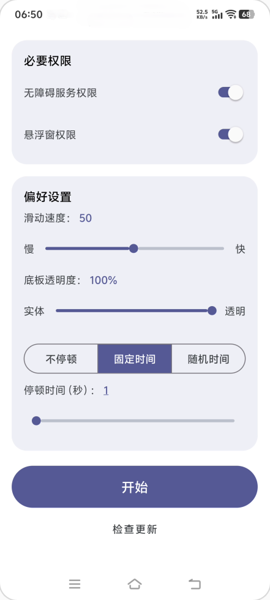

# 安卓自动滑动器APP [AutoSlide]

[简体中文](README.md) | [English](README.en.md)

一款适用于自动化测试与内容浏览的安卓自动滑动工具

## 功能特性

- **停顿模式**：提供⌈不停顿/固定时间/随机时间⌋三种停顿模式
- **滑动速度**：提供多档速度并按平滑曲线控制手势时长
- **滑动方向**：支持上下左右四个方向
- **自定义轨迹**：长按方向按钮录制对应方向的滑动路径并在自动滑动时回放
- **底板透明度**：支持悬浮窗底板透明度无极调节与实时预览
- **悬浮窗控制**：通过悬浮球启停滑动并在运行时自动收缩面板
- **通知栏磁贴**：通过系统快捷设置一键开关悬浮窗服务
- **安全停止**：支持音量键强停与息屏自动停止
- **权限管理**：支持⌈手动开启/Shizuku/ADB⌋三种方式开启无障碍服务

## 截图展示

## 快速开始

### 前提条件

- Android 8.0 及以上版本

### 安装步骤

1. 从[发布页面](https://github.com/tianxing-ovo/AutoSlide/releases/)下载最新的APK文件
2. 打开下载的APK文件并按照屏幕上的指示安装应用程序
3. 启动应用并授予必要的权限以确保其正常运行

## 贡献代码

欢迎提交 Issue 与 Pull Request

## 许可证

本项目采用 [Apache License 2.0](LICENSE)
